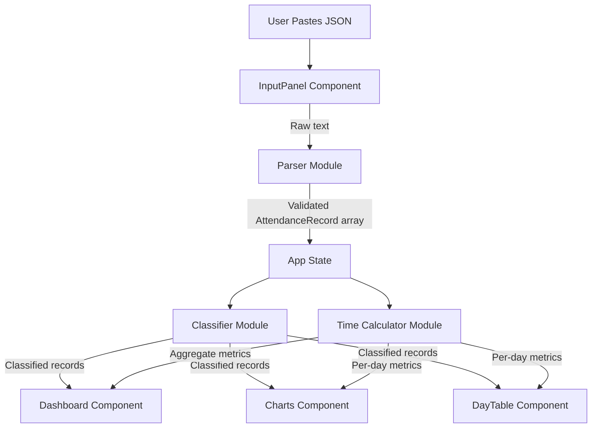
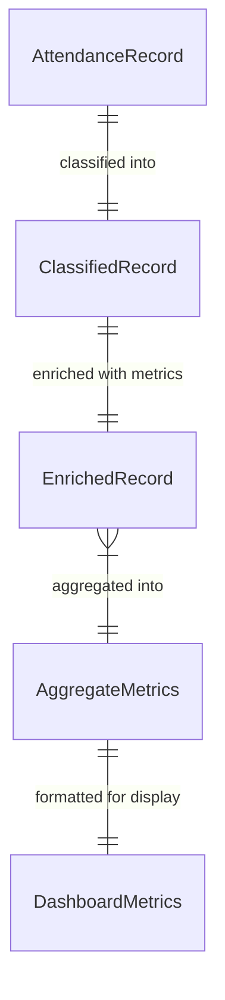

# Design Document: Attendance Insights

## Overview

Attendance Insights is a client-side single-page application that transforms raw JSON attendance data into actionable analytics. Users paste biometric/HR-exported JSON into a textarea, and the app processes it entirely in-browser to produce status classifications, time calculations, summary dashboards, interactive charts, and a sortable day-by-day table.

The application follows a pipeline architecture: raw JSON → parsing/validation → classification → time computation → presentation (dashboard, charts, table). All state lives in React component state — no backend, no localStorage.

**Key Design Decisions:**
- All computation is synchronous and in-memory; datasets are small enough (typically <365 records) that no web workers or pagination are needed.
- A single source of truth (`attendanceData` state) feeds all downstream views.
- Chart rendering is delegated entirely to recharts; custom drawing is avoided.
- TailwindCSS utility classes handle all styling; no CSS files or inline styles.

## Architecture



**Data Flow:**
1. User pastes JSON text into `InputPanel` and clicks "Analyze"
2. `Parser` validates and normalizes the JSON into `AttendanceRecord[]`
3. App stores parsed records in state
4. `Classifier` derives a primary status and late flag for each record
5. `TimeCalculator` computes per-day and aggregate metrics
6. Presentation components (`Dashboard`, `Charts`, `DayTable`) render from classified+computed data

**Module Boundaries:**
- `parser.ts` — Pure function: `string → AttendanceRecord[] | ValidationError`
- `classifier.ts` — Pure function: `AttendanceRecord → ClassifiedRecord`
- `timeCalculator.ts` — Pure functions: per-record metrics and aggregate computations
- Components are display-only; they receive processed data via props.

## Components and Interfaces

### React Components

| Component | Responsibility | Props |
|-----------|---------------|-------|
| `App` | Root state holder, orchestrates data flow | — |
| `InputPanel` | Textarea + Analyze button, error display | `onDataParsed: (data: AttendanceRecord[]) => void` |
| `Dashboard` | Summary card grid | `metrics: DashboardMetrics` |
| `Charts` | Bar, line, pie, weekly charts | `records: ClassifiedRecord[], metrics: TimeMetrics` |
| `DayTable` | Sortable table of all records | `records: EnrichedRecord[]` |

### Logic Modules

#### `parser.ts`

```typescript
export function parseAttendanceData(input: string): ParseResult;

type ParseResult =
  | { success: true; data: AttendanceRecord[] }
  | { success: false; error: string };
```

Validation steps:
1. Trim input; reject if empty → error "No input provided"
2. `JSON.parse`; catch → error with syntax description
3. Normalize single object to array
4. Check each element is a plain object → error if not
5. Check required fields on each object → error listing missing fields

#### `classifier.ts`

```typescript
export function classifyRecord(record: AttendanceRecord): ClassifiedRecord;
```

Returns a `ClassifiedRecord` that extends `AttendanceRecord` with:
- `status`: one of the `DayStatus` union
- `isLateArrival`: boolean (secondary flag)

Classification precedence (evaluated top to bottom, first match wins):
1. `isLeave === 1` → "Leave"
2. Both halves "WO" → "Week Off"
3. Both halves "P" → "Present"
4. One half "P", other in {"FL","EL","HD"} → "Half Day"
5. Either half "FL", neither "P" → "Full Leave"
6. Either half "EL", neither "P" → "Earned Leave"
7. `timeIn === null && timeout === null` → "Missing"
8. Unknown codes → "Other"

Late flag: `presentStatus === "Late"` (independent of primary status).

#### `timeCalculator.ts`

```typescript
export function computeRecordMetrics(record: ClassifiedRecord): RecordMetrics;
export function computeAggregateMetrics(records: ClassifiedRecord[]): AggregateMetrics;
```

Key algorithms:
- `parseHHMM(s: string): number` — converts "HH:MM" to total minutes
- `formatMinutes(m: number): string` — converts minutes to "Xh Ym"
- Shift duration = `parseHHMM(shiftEndTime) - parseHHMM(shiftStartTime)`
- Extra/deficit = `parseHHMM(calculatedWorkingHours) - shiftDuration`
- Aggregates computed only over Worked_Days (Present + Half Day)

## Data Models

### Core Types

```typescript
// Raw input shape (matches JSON from HR system)
interface AttendanceRecord {
  employeeId: number;
  shiftId: number;
  timeIn: string | null;
  timeout: string | null;
  presentStatus: string;
  calculatedWorkingHours: string;
  isLeave: number; // 0 or 1
  shiftStartTime: string;
  shiftEndTime: string;
  shiftCode: string;
  attendanceDate: string;
  updatedFirstHalfStatus: string;
  updatedSecondHalfStatus: string;
}

// Status categories
type DayStatus =
  | "Present"
  | "Week Off"
  | "Leave"
  | "Half Day"
  | "Full Leave"
  | "Earned Leave"
  | "Missing"
  | "Other";

// After classification
interface ClassifiedRecord extends AttendanceRecord {
  status: DayStatus;
  otherDetail?: string; // raw codes when status is "Other"
  isLateArrival: boolean;
}

// After time computation
interface EnrichedRecord extends ClassifiedRecord {
  shiftDurationMinutes: number;
  workedMinutes: number;
  extraDeficitMinutes: number; // positive = extra, negative = deficit
  isWorkedDay: boolean;
}

// Aggregate metrics for dashboard
interface AggregateMetrics {
  totalDays: number;
  statusCounts: Record<DayStatus, number>;
  totalWorkingMinutes: number;
  totalExtraMinutes: number;
  totalShortfallMinutes: number;
  averageWorkMinutes: number;
  workedDayCount: number;
  lateCount: number;
  latePercentage: number;
  earliestTimeIn: string | undefined;
  latestTimeIn: string | undefined;
  earliestTimeout: string | undefined;
  latestTimeout: string | undefined;
  longestDay: { date: string; minutes: number } | undefined;
  shortestDay: { date: string; minutes: number } | undefined;
  lateByShiftCount: number; // timeIn > shiftStartTime count
}

// Dashboard display model
interface DashboardMetrics extends AggregateMetrics {
  formattedTotalHours: string;
  formattedExtraHours: string;
  formattedShortfall: string;
  formattedAverage: string;
}
```

### Data Relationships



## Correctness Properties

*A property is a characteristic or behavior that should hold true across all valid executions of a system — essentially, a formal statement about what the system should do. Properties serve as the bridge between human-readable specifications and machine-verifiable correctness guarantees.*

### Property 1: Parser round-trip preserves all fields

*For any* valid AttendanceRecord array, serializing it to a JSON string and then passing that string through the Parser SHALL produce an output array where each element contains all fields from the corresponding original object with identical values.

**Validates: Requirements 9.1, 1.3, 1.4**

### Property 2: Parser preserves array length

*For any* valid JSON input representing N AttendanceRecord objects (1 for a single object, N for an array of N objects), the Parser SHALL produce an output array of exactly N elements.

**Validates: Requirements 9.2**

### Property 3: Parser type and null fidelity

*For any* valid AttendanceRecord with null field values, the Parser SHALL preserve nulls as null (not undefined or empty string), numeric fields (employeeId, shiftId, isLeave) as numbers, and string fields as strings in the output.

**Validates: Requirements 9.3, 9.4**

### Property 4: Whitespace-only input rejection

*For any* string composed entirely of whitespace characters (spaces, tabs, newlines), the Parser SHALL return an error result indicating no input was provided.

**Validates: Requirements 1.5**

### Property 5: Non-object/array JSON rejection

*For any* valid JSON value that is a primitive (number, string, boolean, null), the Parser SHALL return an error result indicating the data must be an object or array of objects.

**Validates: Requirements 1.7**

### Property 6: Missing required fields detection

*For any* JSON object that is missing one or more required fields (timeIn, timeout, attendanceDate, shiftStartTime, shiftEndTime, calculatedWorkingHours, updatedFirstHalfStatus, updatedSecondHalfStatus, isLeave), the Parser SHALL return an error listing exactly the missing fields.

**Validates: Requirements 1.8**

### Property 7: Classification precedence correctness

*For any* valid AttendanceRecord, the Classifier SHALL assign a status according to the defined precedence rules: isLeave=1 always yields "Leave"; both halves "WO" yields "Week Off"; both halves "P" yields "Present"; one half "P" with other in {"FL","EL","HD"} yields "Half Day"; either half "FL" with neither "P" yields "Full Leave"; either half "EL" with neither "P" yields "Earned Leave"; null timeIn and timeout with no higher match yields "Missing"; unknown codes yield "Other". Higher-precedence rules always override lower ones.

**Validates: Requirements 2.1, 2.2, 2.3, 2.4, 2.5, 2.6, 2.7, 2.8, 2.9**

### Property 8: Late flag independence from primary status

*For any* AttendanceRecord with presentStatus equal to "Late", the Classifier SHALL set isLateArrival to true AND the primary status SHALL be identical to the status that would be assigned if presentStatus were not "Late".

**Validates: Requirements 2.10**

### Property 9: Time format round-trip

*For any* non-negative integer representing minutes, formatting it as "Xh Ym" and then parsing that string back to minutes SHALL produce the original integer. Conversely, for any valid "HH:MM" string, parsing to minutes and then formatting SHALL produce a string representing the same total time.

**Validates: Requirements 3.1, 3.13**

### Property 10: Extra/deficit computation correctness

*For any* Worked_Day record with valid calculatedWorkingHours and shift times, the extra/deficit SHALL equal parseHHMM(calculatedWorkingHours) minus (parseHHMM(shiftEndTime) - parseHHMM(shiftStartTime)).

**Validates: Requirements 3.2, 3.3**

### Property 11: Non-worked day exclusion from aggregates

*For any* set of ClassifiedRecords, adding or removing records classified as non-Worked_Days (Week Off, Leave, Full Leave, Earned Leave, Missing) SHALL NOT change the values of total working hours, total extra time, total shortfall, or average work duration.

**Validates: Requirements 3.4**

### Property 12: Aggregate totals correctness

*For any* set of ClassifiedRecords containing at least one Worked_Day, total working hours SHALL equal the sum of calculatedWorkingHours across Worked_Days, total extra SHALL equal the sum of positive extra/deficit values, and total shortfall SHALL equal the absolute sum of negative extra/deficit values.

**Validates: Requirements 3.5, 3.6, 3.7**

### Property 13: Average work duration correctness

*For any* non-empty set of Worked_Days, the average work duration SHALL equal floor(total working minutes / count of Worked_Days).

**Validates: Requirements 3.9**

### Property 14: Min/max time identification

*For any* set of records containing Worked_Days with non-null timeIn values, earliestTimeIn SHALL equal the minimum timeIn and latestTimeIn SHALL equal the maximum timeIn among those records. The same SHALL hold for timeout values.

**Validates: Requirements 3.10, 3.11**

## Error Handling

### Parser Errors

| Error Condition | User-Facing Message | Behavior |
|----------------|--------------------|---------| 
| Empty/whitespace input | "No input provided. Please paste your attendance JSON data." | Inline error below textarea; no state change |
| Invalid JSON syntax | "Invalid JSON: {syntax error description}" | Inline error below textarea; no state change |
| Valid JSON but wrong structure | "Input must be a single attendance record object or an array of attendance record objects." | Inline error below textarea; no state change |
| Missing required fields | "Missing required fields: {field1, field2, ...}" | Inline error below textarea; no state change |

### Runtime Edge Cases

| Scenario | Handling |
|----------|----------|
| Zero Worked_Days in dataset | Dashboard shows "0h 0m" for averages; charts show only pie chart with non-worked categories |
| All timeIn/timeout null | Line chart hidden with message "Insufficient clock-in/clock-out data"; table shows "—" |
| Single record loaded | All charts render single-data-point versions; dashboard metrics computed from one record |
| Very large dataset (>1000 records) | Synchronous processing; no pagination; browser may lag briefly on low-end devices |
| Tied longest/shortest day | Display earliest date among tied records |

### Error Display Principles

- Errors are always inline (below the input area), never modal dialogs
- Error messages are cleared when the user modifies the textarea content
- Only one error message is shown at a time (first validation failure encountered)
- Error state does not persist across successful parse attempts

## Testing Strategy

### Unit Tests (Example-Based)

Focus on specific scenarios and edge cases:

- **Parser**: Invalid JSON strings, empty input, single object normalization, missing fields with specific field combinations
- **Classifier**: One example per classification rule, boundary cases between rules
- **TimeCalculator**: Zero worked days, all-null times, single day, tied longest/shortest
- **Dashboard**: Known input → expected card values
- **Table**: Sort toggle behavior, color class assignment

### Property-Based Tests

Using [fast-check](https://github.com/dubzzz/fast-check) as the PBT library for TypeScript/JavaScript.

**Configuration:**
- Minimum 100 iterations per property
- Each test tagged with: `// Feature: attendance-insights, Property {N}: {title}`

**Properties to implement:**
1. Parser round-trip (Property 1)
2. Parser length preservation (Property 2)
3. Parser type/null fidelity (Property 3)
4. Whitespace rejection (Property 4)
5. Non-object JSON rejection (Property 5)
6. Missing fields detection (Property 6)
7. Classification precedence (Property 7)
8. Late flag independence (Property 8)
9. Time format round-trip (Property 9)
10. Extra/deficit correctness (Property 10)
11. Non-worked day exclusion (Property 11)
12. Aggregate totals (Property 12)
13. Average correctness (Property 13)
14. Min/max time identification (Property 14)

### Integration Tests

- Full data flow: paste JSON → parse → classify → compute → render dashboard
- Chart rendering with recharts (verify correct data props passed)
- Responsive layout at 320px and 1920px viewports

### Test Organization

```
src/
├── utils/
│   ├── parser.ts
│   ├── parser.test.ts          # unit + property tests for parser
│   ├── classifier.ts
│   ├── classifier.test.ts      # unit + property tests for classifier
│   ├── timeCalculator.ts
│   └── timeCalculator.test.ts  # unit + property tests for time calc
├── components/
│   ├── InputPanel.tsx
│   ├── Dashboard.tsx
│   ├── Charts.tsx
│   └── DayTable.tsx
└── __tests__/
    └── integration.test.tsx    # full flow integration tests
```

### Test Runner

- **Vitest** (ships with Vite) for all unit and property tests
- **@testing-library/react** for component integration tests
- Run with `vitest --run` for CI, `vitest` for watch mode during development

